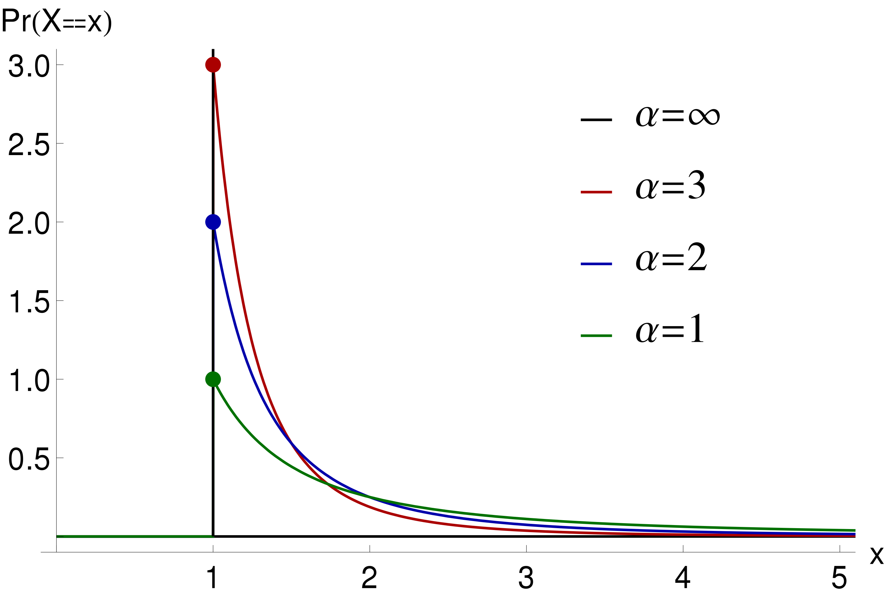
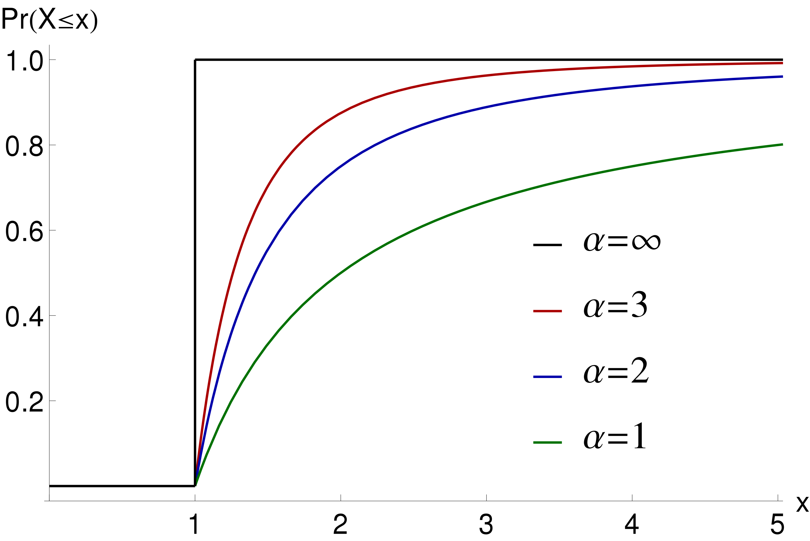

```{r setup, include=FALSE}
knitr::opts_chunk$set(echo = TRUE)
#knitr::opts_chunk$set(fig.pos = "!H", out.extra = "")

# options(knitr.table.format = function() {
#   if (knitr::is_latex_output()) 
#     "latex" else "pipe"
# })

library(tidyverse)
library(knitr)
library(kableExtra)

```


# Background

- During the course of the covid_19 pandemic, the proportion of positive tests was highlighted as an important indicator of case underreporting.

- Very low values of test positivity suggest a small proportion of undetected cases.

- Conversely, case numbers are less reliable as test positivity increases, with more cases going undetected.

- Test positivity, and how it changes with the number of tests conducted per population, is a consequence of how individuals are chosen for testing. 

- With random testing, test positivity should be equal to infection prevalence in the population, independently of testing coverage (no. of tests per population).

- However, if testing is targeted, with high-risk individuals tested first, a monotonic decrease in test positivity with testing coverage is expected.

- Individuals at high risk of prevalent infection may be identified in various ways, such as presence of various symptoms, connection to other cases, location, etc. 

- While the mentioned qualitative insights on test positivity are widely applied to interpret covid19 testing data, there has to my knowledge not been a simple formula available that directly relates test postivity and the amount of case underreporting in a quantitative way.

- Such a formula could be used to inform policy by 1) providing estimates of true case numbers when test positivity is high, 2) predict the impact of ramping up testing on the proportion of detected cases (and hence on transmission reduction through case finding), and 3) to describe and compare testing strategies across geographic areas through comparison of formula parameters estimated from area-specific data.


# Objectives


- To derive a quantitative modeling framework relating test positivity, testing coverage, and case underreporting

- To fit the model to data, in order to estimate unknown model parameters and assess model adequacy.

- To demonstrate the application of this framework to answer questions on true case numbers and on the expected transmission-reducing benefit of additional testing.


\newpage


# The Pareto distribution

The proportion of detected cases as function of the testing coverage (tests conducted per true case) is assumed to follow the CDF of a Pareto distribution. 

**Pareto Type I distribution (Source: Wikipedia):**

\begin{center}
\begin{figure}[H]
  \includegraphics[width=0.4\columnwidth]{Probability_density_function_of_Pareto_distribution.png} ~~
  \includegraphics[width=0.4\columnwidth]{Cumulative_distribution_function_of_Pareto_distribution.png}
  \caption{Pareto Type I PDF's (left) \& CDF's (right) for various $\alpha$  with ${\displaystyle x_{\mathrm {m} }=1.}$}
\end{figure}
\end{center}


<!-- |  |  | -->


# A probabilistic model of the testing process


## Model parameters


<!-- | Parameter      | Definition | -->
<!-- | ----------- | ----------- | -->
<!-- | t           | No. of tests conducted  | -->
<!-- | n           | No. of cases detected        | -->
<!-- | $\nu$          | True no. of cases (incl. undetected)        | -->
<!-- | $d = \frac{n}{\nu}$           |  Fraction of cases detected | -->
<!-- | $p = \frac{n}{t}$           | Test positivity       | -->
<!-- | $\tau = \frac{t}{\nu}$           | Testing coverage  | -->
<!-- | $\tau_{min} := 1$          |  Minimum testing coverage (Pareto distribution parameter)       | -->
<!-- | $\alpha$          | Testing efficiency coefficient  (Pareto distribution parameter) | -->


\bigskip


```{r, echo = FALSE}

tableData <- tibble(
  Parameter = c(
    '$t$',
    '$n$',
    '$\\nu$',
    '$d = \\frac{n}{\\nu}$',
    '$p = \\frac{n}{t}$',
    '$\\tau = \\frac{t}{\\nu}$',
    '$\\tau_{min} := 1$',
    '$\\alpha$'
  ),

  Definition = c(
   "No. of tests conducted",
   "No. of cases detected",
   "True no. of cases (incl. undetected)",
   "Fraction of cases detected",
   "Test positivity",
   "Testing coverage",
   "Minimum testing coverage (Pareto distribution parameter)",
   "Testing efficiency coefficient  (Pareto distribution parameter)"
  )
) 

 if (knitr::is_html_output()){
    tableData %>%
    kable(format = 'html') %>%
     kable_styling(position = "left") 
 } else {
     suppressWarnings(
  tableData %>%
    kable(format = 'pipe') %>%
    kable_styling()
  )
 }

```

\bigskip

## Model description


- Consider all individuals in the testing-eligible population, arranged from high to low predicted infection probability (as determined by the applied testing strategy)

- Assume testing proceeds from the invidiual with highest to the one with lowest predicted probility of infection.

- Each detected case can be viewed as the final, successful attempt in a series of 1 or more testing attempts to find the next case. 

- The number of attempts required to find the next case can thus be modeled as a Pareto distribution, with most cases found after only few unsuccessful attempts, but a very large number of attempts being necessary to find all or almost all cases.

- The Pareto cumulative distribution function describes the proportion of true cases that are detected given the number of tests performed per true case.

- The testing efficiency coefficient $\alpha$ describes how quickly the success rate (test prositivity) decreases with the number of tests per true case.

- Model definition: the observed test positivity (proportion of positive tests within a time period and population) is related to the fraction of detected cases precisely as is the testing coverage (tests conducted per true case) to the CDF of a Pareto distribution. #TODO say it better.


## Model derivation

Define 


\begin{equation}
F(\tau) = 1 - \left(\frac{\tau_{min}}{\tau} \right)^\alpha
\end{equation}

for $\tau \ge \tau_{min}$, and $F(\tau) = 0$ for $\tau < \tau_{min}$.


Setting $\tau_{min} = 1$ and rewriting $F$ as $\frac{n}{\nu}$ this yields

\begin{equation}
d = \frac{n}{\nu} = 1 - \left(\frac{\tau_{min}}{\tau}\right)^\alpha
\end{equation}

\[
\tau_{min} := 1
\]


\begin{equation}
d = \frac{n}{\nu} = 1 - \left( \frac{\nu}{} \right)
\end{equation}


# Estimation of $\alpha$

\begin{equation}
a = \int_a^b c(x)  dx 
\end{equation}


**data**
https://www.ijidonline.com/article/S1201-9712(20)30444-6/fulltext#secsect0095

```{r}

case_data <- read_csv("data_capture_mark_recapture.csv") %>%
  transmute(
    Country,
    Hidden_cases = `Hidden cases`,
    Total_cases = `Total cases`,
    Observed_cases = `Total_cases` - Hidden_cases
  )

#From our world in data
test_data <- read_csv("covid-testing-all-observations.csv") %>%
  filter(str_detect(Entity, "Italy|Germany|Spain|United Kingdom|Greece|Austria")) %>%
  filter(str_detect(Entity, "tests performed|samples tested")) %>% 
  mutate(
    Country = case_when(
      `ISO code` == "AUT" ~ "Austria",
      `ISO code` == "DEU" ~ "Germany",
      `ISO code` == "GRC" ~ "Greece",
      `ISO code` == "ITA" ~ "Italy",
      `ISO code` == "ESP" ~ "Spain",
      `ISO code` == "GBR" ~ "UK",
      TRUE ~ NA_character_
    )
  ) %>%
  filter(Date == as.Date("2020-04-17")) %>%
  select(
    Country,
    Date,
    Cumulative_tests = `Cumulative total`
  ) %>%
  filter(!is.na(Cumulative_tests))


plotData <- case_data %>%
  inner_join(test_data, by = "Country") %>%
  mutate(
    `log(1-n/nu)` = log(1-(Observed_cases/Total_cases)),
    `log(nu/t)` = log(Total_cases/Cumulative_tests)
  )
  


mod.lm <- lm(`log(1-n/nu)` ~  -1 + `log(nu/t)`, data = plotData)

ggplot(plotData, aes(x = `log(nu/t)`, y = `log(1-n/nu)`,)) +
  geom_label(aes(label = Country), nudge_y = 0.1) +
  geom_point() +
  #geom_smooth(method='lm', formula= y ~  -1 + x)
  geom_abline(slope = coef(mod.lm), intercept =0) +
  coord_cartesian(xlim = c(-3, 0), ylim = c(-1, 0))


pander::pander(mod.lm)

alpha <- coef(mod.lm) %>% as.numeric
```


```{r}

one_step_d <- function(nu, t, alpha){
  1-(nu/t)^alpha
}

calc_d <- Vectorize(function(n, t, alpha){
  d <- 0.5 #starting value
  for(i in 1:1000) {
    new_d <- one_step_d(nu = n*d, t = t, alpha)
    if(new_d == d) {
      break
    } else {
        d <- new_d
      }
  }
  d
})

calc_d(n = 172433, t = 1244108, alpha)

```


# Estimating the detected proportion d from data, given $\alpha$

```{r}

plotData <- tibble(
  tau = 1:1000
) %>%
mutate(
  d = calc_d(n = 100, t = tau*100, alpha = alpha )    
)

ggplot(plotData, aes(x = tau, y = d)) +
  geom_line() +
  scale_x_log10() +
  theme_minimal()

```


# The transmission-reducing effect of testing and contact tracing

..


